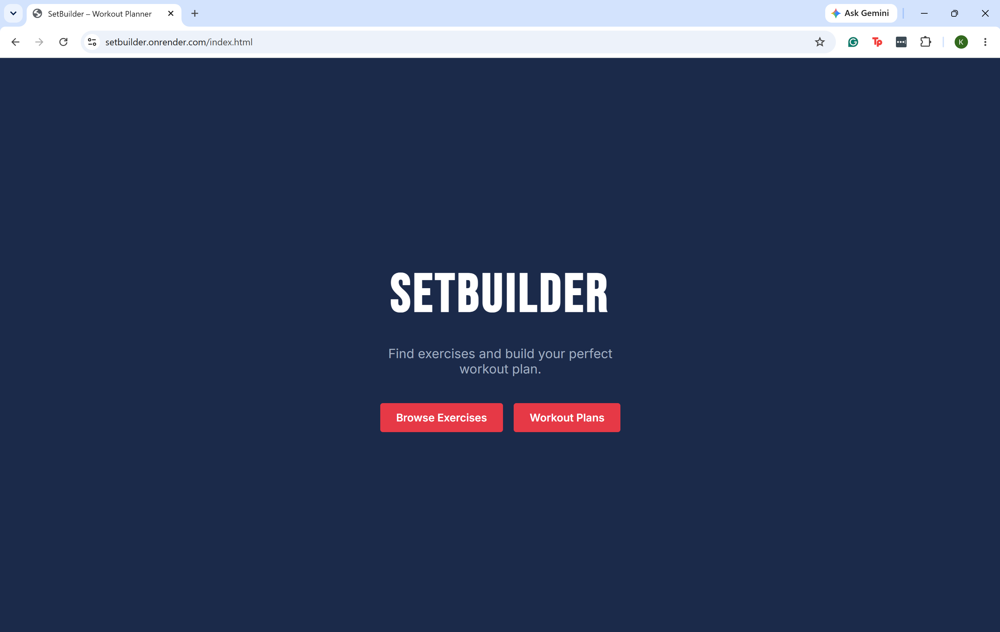
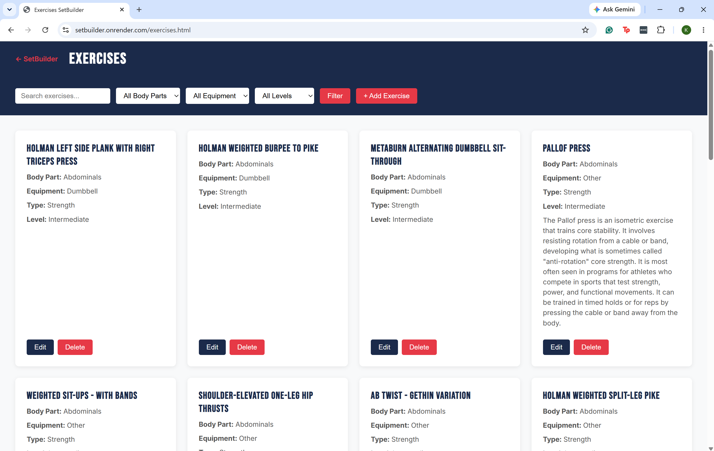
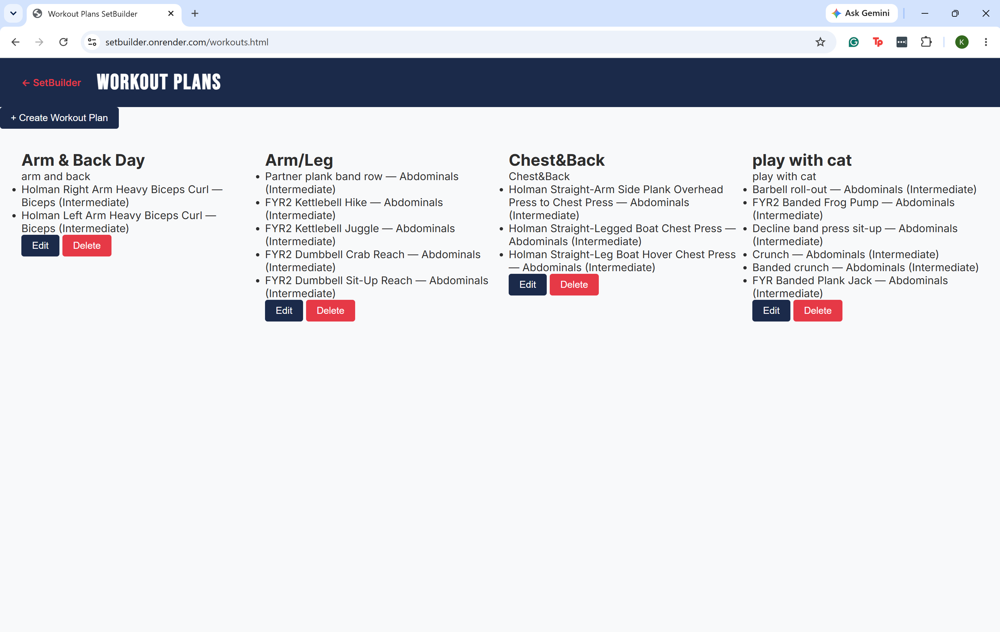

# SetBuilder – Workout Planner

**Authors:** Kaylee Faherty, Haotian Qian  
**Course:** CS5610 Web Development – Northeastern University  
**Class Link:** https://johnguerra.co/classes/webDevelopment_online_summer_2026/
**Live Demo:** https://setbuilder.onrender.com

## Project Objective

SetBuilder is a full stack fitness web application that helps users discover exercises and build custom workout plans. Users can browse a library of 2,900+ exercises filtered by muscle group, equipment, and difficulty level. The app also includes a random workout generator that lets users select target muscle groups and generate a randomized workout. Users can also create, save, and manage custom workout plans, building routines from the exercise library.

## Screenshots





## Video Demonstration

[Watch the demo](link to be added)

## Tech Stack

- Frontend: Vanilla JavaScript (ES6 Modules), HTML5, CSS3
- Backend: Node.js + Express
- Database: MongoDB Atlas (Native Driver)
- Deployment: Render

## Instructions to Build

1. Clone the repository:
```bash
   git clone https://github.com/Fahertyk-NU/setbuilder.git
   cd setbuilder
```

2. Install dependencies:
```bash
   npm install
```

3. Create a `.env` file in the root directory:
MONGO_URI=your_mongodb_connection_string
PORT=3000

4. Seed the database:
```bash
   node server/seed.js
```

5. Start the server:
```bash
   npm start
```

6. Open your browser and go to `http://localhost:3000`


## Pages

| Page           | URL                  | Description                                      |
| -------------- | -------------------- | ------------------------------------------------ |
| Homepage       | `index.html`         | Landing page with navigation to both sections    |
| Exercises      | `exercises.html`     | Browse, filter, add, edit, and delete exercises  |
| Workout Plans  | `workouts.html`      | Create and manage custom workout plans           |


## GenAI Usage

**Kaylee Faherty:** Claude Sonnet (Anthropic, claude-sonnet-4-6) was used throughout this project as a learning guide and coding assistant. It was used to explain concepts, talk through architectural decisions, troubleshoot errors, and suggest approaches as I built out the Express/MongoDB backend, frontend JavaScript, and CSS. All generated code was carefully reviewed, tested, and understood before being committed. Key prompts included project planning, setting up the Express/MongoDB architecture, implementing CRUD routes, and building the random workout generator feature.

**Haotian Qian:** Claude Sonnet (Anthropic, claude-sonnet-4-6) was used throughout this project as a coding assistant and debugging aid. It was used to clarify concepts, discuss implementation strategies, diagnose issues, and suggest solutions as I built the workout plans feature, including the CRUD interface, inline exercise search with live filtering, and the form-based plan editor. All generated code was reviewed, tested, and understood before being committed. Key prompts included designing the workout plan data model, wiring up the frontend form state to REST API calls, and handling edit vs. create mode in a single shared form.

## License

[MIT](./LICENSE)
